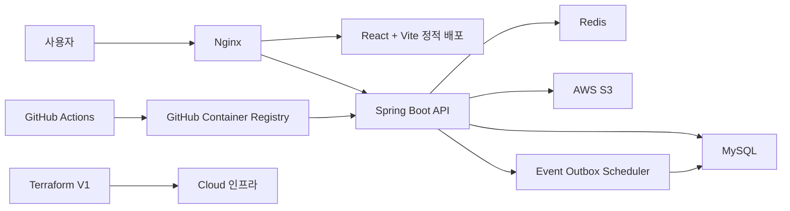

# 종주메이트

국토종주 라이더가 코스별 정보, 주행 기록, 장비 팁, 코스 상태를 공유하는 커뮤니티 서비스입니다.

- 서비스: [http://hiking.monster/](http://hiking.monster/)
- 프로젝트 기간: 2025.09.15 ~ 2025.12.09
- 개발 인원: 1인 개인 프로젝트
- 프로젝트 영상: [YouTube](https://youtu.be/wcZGfpMFt_s)
- 인프라 저장소: [community-CLOUD/V1/terraform](https://github.com/kimseonj/community-CLOUD/tree/main/V1/terraform)

## 주요 기능

- 게시글/댓글 작성, 이미지 업로드, 게시글 타입별 목록 조회
- 게시글 좋아요 토글, 좋아요 수/댓글 수/조회 수 통계 관리
- 인기글 Top10 조회와 Redis cache-aside 캐싱
- 코스 상태 제보, 코스별 알림받기, 인앱 알림 조회
- JWT 기반 인증과 HTTP-only 쿠키 기반 토큰 관리
- Swagger UI 기반 API 문서 제공

## 기술 스택

| 영역 | 기술 |
|---|---|
| Backend | Java 21, Spring Boot 3.5.6, Spring Web, Spring Data JPA |
| Database | MySQL 8, Redis 7 |
| Auth | JWT, Spring Security Crypto, HTTP-only Cookie |
| Storage | AWS S3, 로컬 파일 저장소 전략 분리 |
| Observability | Spring Boot Actuator, Micrometer, Prometheus, datasource-proxy, JSON Logging |
| Infra | Cloud VM, GHCR, SSH, Nginx, Docker |
| IaC / CI/CD | Terraform, GitHub Actions |
| Test | JUnit 5, Mockito, Spring Boot Test, k6 |

## 시스템 아키텍처



- 프론트엔드는 React + Vite 빌드 산출물을 Nginx로 정적 배포합니다.
- 백엔드는 Docker 이미지로 빌드해 GHCR에 푸시하고, GitHub Actions에서 SSH로 대상 서버에 배포합니다.
- 클라우드 인프라는 별도 저장소의 `V1/terraform` 구성으로 관리합니다.
- API 서버는 MySQL을 원본 데이터 저장소로 사용하고, Redis는 인기글 캐시와 인증/세션성 데이터 처리에 사용합니다.

## 핵심 개선 및 검증

### SQL 카운트 기반 N+1 회귀 방지

**문제**
게시글/댓글 목록 조회에서 작성자, 프로필 이미지 등 연관 엔티티를 지연 로딩하면 데이터 개수만큼 추가 SQL이 발생할 수 있었습니다.

**적용**
게시글 목록은 DTO Projection으로 필요한 컬럼만 조회하고, 댓글 목록은 `@EntityGraph(attributePaths = "user")`로 댓글 작성자를 함께 조회하도록 개선했습니다. 또한 datasource-proxy로 요청별 SQL 실행 수를 측정하고, N+1 전용 통합 테스트에서 임계값을 넘으면 실패하도록 만들었습니다.

**검증**
`NPlusOneIntegrationTest`에서 주요 조회 API의 SQL 수를 하드 단언합니다.

| API | 기준 |
|---|---:|
| `GET /posts` | 최대 2 queries |
| `GET /posts/top10` | 최대 2 queries |
| `GET /posts/{id}` | 최대 2 queries |
| `GET /posts/{id}/comments` | 최대 4 queries |
| `GET /posts/{id}/likes` | 최대 2 queries |

### 좋아요 토글 동시성 제어

**문제**
좋아요 토글은 “현재 좋아요 여부 확인 후 등록/삭제”하는 check-then-act 흐름이라 동일 게시글에 요청이 몰리면 정합성 또는 가용성 문제가 발생할 수 있었습니다.

**적용**
`post_statuses` 행에 `PESSIMISTIC_WRITE` 락을 획득해 같은 게시글의 좋아요 토글 구간을 직렬화했습니다. `post_likes(user_id, post_id)`에는 유니크 제약을 두고, 좋아요 카운트는 Native Query로 원자적으로 증감합니다.

**검증**
`CountDownLatch` 기반 100스레드 동시 요청 테스트로 모든 요청이 제한 시간 안에 완료되고, `post_likes` 실제 row 수와 `post_statuses.like_count`가 일치하는지 확인합니다.

### 인기글 Top10 조회 기준선 측정과 캐시 적용

**문제**
게시글 100만 건, 좋아요 500만 건 테스트 데이터에서 인기글 Top10 조회가 전체 테이블 스캔으로 이어져 커넥션 풀이 고갈되는 병목을 확인했습니다.

**측정 기준선**
`scripts/k6/top10/BASELINE_RESULTS.md`에 동일 조건으로 재현 가능한 기준선을 기록했습니다.

| 항목 | 측정값 |
|---|---:|
| 데이터 규모 | 게시글 100만 건, 좋아요 500만 건 |
| 부하 조건 | k6, 50 VUs, 5분 |
| `GET /posts/top10` p95 | 35s |
| 전체 에러율 | 45.4% |
| HikariCP pending threads | 40+ |

**적용**
Top10 조회는 최근 2개월 완료 게시글로 범위를 제한하고, Redis cache-aside 방식으로 결과를 5분간 캐시합니다. Redis 장애 시에는 DB fallback으로 조회가 가능하도록 구성했습니다.

**남은 개선 방향**
현재 cache-aside 구조는 TTL 동안 순위 반영이 지연될 수 있습니다. 좋아요 토글 시 Redis Sorted Set score를 함께 갱신하고 `ZREVRANGE`로 상위 게시글 ID를 조회하는 방식으로 실시간 반영 구조를 검토하고 있습니다.

### Outbox Scheduler 알림 처리 분리

**문제**
코스 상태 제보 요청 안에서 구독자 알림을 모두 생성하면 사용자 요청 시간이 구독자 수에 직접 영향을 받습니다.

**적용**
제보 등록 트랜잭션에서는 `event_outbox` 이벤트만 저장합니다. Scheduler는 Outbox claim과 상태 기록을 짧은 독립 트랜잭션으로 처리하고, 구독자의 `subscription_id`, `user_id`만 500건씩 keyset 조회해 `JdbcTemplate.batchUpdate`로 저장합니다. 각 chunk는 독립 커밋되며 `(event_id, user_id)` 유니크 충돌만 no-op 처리합니다.

**검증 방식**
H2 통합 테스트로 projection 조회와 재처리 멱등성을 확인합니다. 로컬 MySQL 8.4.8의 구독자 100,000명 코스에서 `EXPLAIN ANALYZE`한 첫 500건 keyset 조회는 `PRIMARY` range scan으로 600건을 읽고 500건을 반환했으며 실제 실행 시간은 1.54~1.65ms였습니다. 추가 인덱스는 만들지 않았습니다.

**검증 결과**
MySQL에서 chunk 부분 실패·재처리·동시 claim을 통합 테스트했습니다. 동일한 100,000명 조건을 3회 측정한 결과 중앙값 기준 처리 시간은 22.10초에서 6.92초, Peak Heap은 654.9MiB에서 315.1MiB, Peak RSS는 1,099.8MiB에서 697.2MiB로 감소했으며 알림 100,000건과 중복 0건을 유지했습니다. 추가로 5,000명, 10,000명, 50,000명 코스를 단회 측정해 구독자 수 증가 시 처리 시간은 증가하지만 Heap 상한은 chunk 단위로 제한되는 것을 확인했습니다. 상세 조건과 원시 결과는 [Outbox 대량 알림 메모리 개선 측정](docs/OUTBOX_NOTIFICATION_MEMORY_BENCHMARK.md)에 기록했습니다.

## 대용량 테스트 데이터

성능 검증을 위해 JDBC Batch Insert 기반 더미 데이터 생성기를 제공합니다.

| 데이터 | 규모 |
|---|---:|
| User | 10,000명 |
| Post | 1,000,000건 |
| PostStatus | 1,000,000건 |
| Comment | 2,000,000건 |
| PostLike | 5,000,000건 |
| CommentLike | 1,000,000건 |
| Image | 300,000건 |
| PostImage | 300,000건 |

실행 시 `DATA_GENERATOR_ENABLED=true` 또는 `data.generator.enabled=true`로 활성화합니다. 기존 users 데이터가 있으면 생성을 건너뛰며, MySQL JDBC URL에는 배치 최적화를 위해 `rewriteBatchedStatements=true` 옵션을 사용할 수 있습니다.

```bash
DATA_GENERATOR_ENABLED=true ./gradlew bootRun
```

## 로컬 실행

```bash
docker compose -f docker-compose.local.yml up -d
./gradlew bootRun
```

기본 프로필은 `local`이며, API context path는 `/api`입니다.

- Swagger UI: `http://localhost:8080/api/swagger-ui.html`
- Actuator health: `http://localhost:8080/api/actuator/health`
- Prometheus metrics: `http://localhost:8080/api/actuator/prometheus`

## 테스트

```bash
# 단위/일반 통합 테스트
./gradlew test

# N+1 회귀 방지 테스트
./gradlew nPlusOneTest

# 로컬 성능 관찰 테스트
./gradlew performanceTest
```

Outbox와 Top10 부하 테스트는 k6 스크립트로 별도 실행합니다.

```bash
k6 run scripts/k6/baseline.js
k6 run scripts/k6/outbox-scheduler-load.js
```

## 문서

- [성능 측정/최적화 가이드](./docs/PERFORMANCE_OPTIMIZATION_GUIDE.md)
- [포트폴리오 개선사항 정리](./docs/PORTFOLIO_IMPROVEMENTS.md)
- [Outbox Scheduler 부하 테스트](./scripts/k6/outbox-scheduler-load.md)
- [Top10 기준선 측정 결과](./scripts/k6/top10/BASELINE_RESULTS.md)
